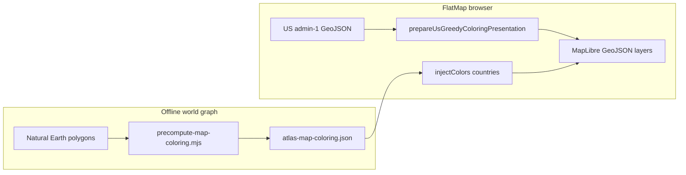

# Greedy graph coloring on the flat map — speaker notes

Educational outline for presenting **Welsh–Powell + first-fit greedy** US-state coloring in ATLAS. One document: narrative + **embedded source** so you rarely jump between files during Q&A.

**Related files:** [`src/map/usStatesGreedyColoringPresentation.js`](../src/map/usStatesGreedyColoringPresentation.js), [`src/components/Globe/FlatMap.jsx`](../src/components/Globe/FlatMap.jsx), [`scripts/precompute-map-coloring.mjs`](../scripts/precompute-map-coloring.mjs).

---

## 1. The four-color map problem

**Story.** Political regions on a map are **vertices**. Two regions **share a land border** ⇔ **edge** between those vertices. A **coloring** assigns each vertex an integer label (“color”) so **no edge** joins two vertices with the **same** label — a **proper coloring**.

**Four-color theorem.** Every **planar** graph (drawn on the plane/sphere without edges crossing) admits a proper coloring using **at most four** colors. Informally: many world maps behave like planar graphs (ignore pathological borders/exclaves in one sentence).

**Chromatic number χ(G).** Smallest **k** such that a proper **k**-coloring exists. Always χ(G) ≥ **ω(G)** (size of largest **clique** — mutual neighbors).

**Greedy ≠ optimal.** A **greedy** algorithm picks an **order** of vertices and assigns each vertex the **smallest available color** given neighbors already colored. It always produces a **proper** coloring **if the adjacency graph is correct**, but it may use **more than χ** colors depending on order.

---

## 2. Two pipelines in ATLAS (do not conflate)

| Layer | Input | Algorithm | Where |
|--------|--------|-----------|--------|
| **World countries (+ merged graph)** | Offline script builds adjacency from Natural Earth | **Exact:** clique lower bound ω, then **backtracking k-colorability** from k = ω upward until feasible → writes [`public/atlas-map-coloring.json`](../public/atlas-map-coloring.json) | [`scripts/precompute-map-coloring.mjs`](../scripts/precompute-map-coloring.mjs) |
| **US states (FlatMap live demo)** | Same admin-1 GeoJSON in the browser | **Welsh–Powell order + first-fit greedy**; **verify** proper coloring; optional **exact minimal k** fallback with **same animation order** | [`usStatesGreedyColoringPresentation.js`](../src/map/usStatesGreedyColoringPresentation.js) |

At runtime, **countries** read precomputed indices from JSON and map them through **`ATLAS_COLORS`**. **US states** start neutral gray; when the viewport focuses on the USA, an interval replays **`steps`** one state at a time.



---

## 3. Tech stack (one slide)

| Piece | Choice |
|--------|--------|
| UI | React + Vite |
| Map | MapLibre GL JS |
| Country/state geometry | Natural Earth 50m (CDN URLs in [`FlatMap.jsx`](../src/components/Globe/FlatMap.jsx)) |
| Labels | Carto **dark_only_labels** raster tiles |
| Offline χ | Node **`npm run precompute-coloring`** |

---

## 4. Codespace — geometry → graph → colors

### 4.1 Canonical boundary segments (rounding)

GIS polygons often **almost** touch; we **quantize** endpoints so matching segments collapse to one key. Same spirit as the offline script.

```49:57:atlas/src/map/usStatesGreedyColoringPresentation.js
function round4(n) {
  return Math.round(n * 1e4) / 1e4
}

function edgeKey(x1, y1, x2, y2) {
  const p1 = `${round4(x1)},${round4(y1)}`
  const p2 = `${round4(x2)},${round4(y2)}`
  return p1 < p2 ? `${p1}|${p2}` : `${p2}|${p1}`
}
```

### 4.2 Adjacency from shared edges (USA states)

Walk every ring segment; **exactly two** owning features ⇒ **border** between those states (undirected edge).

```94:117:atlas/src/map/usStatesGreedyColoringPresentation.js
export function buildUsStateAdjacency(features, getKey = getUsStateRegionKey) {
  const keys = features.map(getKey)
  const adj = new Map()
  for (const k of keys) {
    if (k && !adj.has(k)) adj.set(k, new Set())
  }

  const edgeOwners = new Map()
  for (let fi = 0; fi < features.length; fi++) {
    addRingEdges(features[fi].geometry, fi, edgeOwners)
  }

  for (const owners of edgeOwners.values()) {
    if (owners.size !== 2) continue
    const [ia, ib] = [...owners]
    const ka = keys[ia]
    const kb = keys[ib]
    if (!ka || !kb || ka === kb) continue
    adj.get(ka).add(kb)
    adj.get(kb).add(ka)
  }

  return adj
}
```

**Offline parallel** (countries + US merged): identical segment hashing pattern before folding into numeric ids.

```21:57:atlas/scripts/precompute-map-coloring.mjs
function round4(n) {
  return Math.round(n * 1e4) / 1e4
}

function edgeKey(x1, y1, x2, y2) {
  const p1 = `${round4(x1)},${round4(y1)}`
  const p2 = `${round4(x2)},${round4(y2)}`
  return p1 < p2 ? `${p1}|${p2}` : `${p2}|${p1}`
}

function addRingEdges(geom, featureIndex, edgeOwners) {
  if (!geom) return
  if (geom.type === 'Polygon') {
    for (const ring of geom.coordinates || []) {
      addRingEdgesFromCoords(ring, featureIndex, edgeOwners)
    }
  } else if (geom.type === 'MultiPolygon') {
    for (const poly of geom.coordinates || []) {
      for (const ring of poly || []) {
        addRingEdgesFromCoords(ring, featureIndex, edgeOwners)
      }
    }
  }
}

function addRingEdgesFromCoords(ring, featureIndex, edgeOwners) {
  if (!ring || ring.length < 2) return
  const m = ring.length
  for (let i = 0; i < m; i++) {
    const a = ring[i]
    const b = ring[(i + 1) % m]
    if (!Array.isArray(a) || !Array.isArray(b) || a.length < 2 || b.length < 2) continue
    const k = edgeKey(a[0], a[1], b[0], b[1])
    if (!edgeOwners.has(k)) edgeOwners.set(k, new Set())
    edgeOwners.get(k).add(featureIndex)
  }
}
```

### 4.3 Welsh–Powell order + greedy coloring

**Order:** sort by **degree descending** — high-connectivity vertices first.

```253:255:atlas/src/map/usStatesGreedyColoringPresentation.js
export function welshPowellOrder(adj, ids) {
  return [...ids].sort((a, b) => (adj.get(b)?.size ?? 0) - (adj.get(a)?.size ?? 0))
}
```

**Greedy:** for each vertex in that order, forbid colors already taken by **colored neighbors**; pick **smallest** unused integer **c**; map **c → hex** via palette modulo.

```261:281:atlas/src/map/usStatesGreedyColoringPresentation.js
export function greedyColorStepsWelshPowell(adj, orderedIds, palette) {
  const colorOf = new Map()
  const steps = []
  let maxIdx = -1
  for (const v of orderedIds) {
    const used = new Set()
    for (const nb of adj.get(v) || []) {
      if (colorOf.has(nb)) used.add(colorOf.get(nb))
    }
    let c = 0
    while (used.has(c)) c++
    colorOf.set(v, c)
    maxIdx = Math.max(maxIdx, c)
    steps.push({
      regionId: v,
      colorIndex: c,
      colorHex: palette[c % palette.length] ?? palette[0],
    })
  }
  return { steps, colorsUsed: maxIdx + 1 }
}
```

### 4.4 Verify proper coloring

```124:133:atlas/src/map/usStatesGreedyColoringPresentation.js
function verifyProperColoring(adj, ids, colorIndexById) {
  for (const u of ids) {
    const cu = colorIndexById.get(u)
    if (cu === undefined) return false
    for (const v of adj.get(u) || []) {
      if (colorIndexById.get(v) === cu) return false
    }
  }
  return true
}
```

### 4.5 Exact fallback (same animation order)

If greedy ever fails verification on bad geometry, find **minimal k** with **`findKColoring`** (backtracking), then emit **`steps`** still ordered by **Welsh–Powell** so the deck cadence unchanged.

```218:246:atlas/src/map/usStatesGreedyColoringPresentation.js
function exactColorStepsForAnimation(adj, welshPowellOrderIds, palette, ids) {
  const { idList, adj: adjIdx } = idsToIndexedAdjacency(ids, adj)
  const n = idList.length
  let best = null
  let bestK = Infinity
  for (let k = 1; k <= Math.min(n, 12); k++) {
    const col = findKColoring(adjIdx, n, k)
    if (col) {
      best = col
      bestK = k
      break
    }
  }
  if (!best) return null

  const colorById = new Map(idList.map((id, i) => [id, best[i]]))
  let maxIdx = -1
  const steps = welshPowellOrderIds.map((regionId) => {
    const ci = colorById.get(regionId) ?? 0
    maxIdx = Math.max(maxIdx, ci)
    return {
      regionId,
      colorIndex: ci,
      colorHex: palette[ci % palette.length] ?? palette[0],
    }
  })
  return { steps, colorsUsed: maxIdx + 1 }
}
```

**Shared solver shape with offline script:** next-variable heuristic + DFS assignment (`findKColoring` in presentation module mirrors [`precompute-map-coloring.mjs`](../scripts/precompute-map-coloring.mjs)).

```153:216:atlas/src/map/usStatesGreedyColoringPresentation.js
function findKColoring(adj, n, k) {
  if (k <= 0) return n === 0 ? [] : null
  if (n === 0) return []
  const color = new Array(n).fill(-1)

  function legalCount(v) {
    const used = new Set()
    for (const u of adj[v] || []) {
      if (color[u] >= 0) used.add(color[u])
    }
    return k - used.size
  }

  function nextVertex() {
    let best = -1
    let bestLegal = k + 1
    let bestDeg = -1
    for (let v = 0; v < n; v++) {
      if (color[v] >= 0) continue
      const used = new Set()
      for (const u of adj[v] || []) {
        if (color[u] >= 0) used.add(color[u])
      }
      const lc = k - used.size
      const deg = adj[v]?.size || 0
      if (
        best < 0 ||
        lc < bestLegal ||
        (lc === bestLegal && deg > bestDeg) ||
        (lc === bestLegal && deg === bestDeg && v < best)
      ) {
        best = v
        bestLegal = lc
        bestDeg = deg
      }
    }
    return best
  }

  function backtrack() {
    let uncolored = 0
    for (let v = 0; v < n; v++) {
      if (color[v] < 0) uncolored++
    }
    if (uncolored === 0) return true
    const v = nextVertex()
    if (legalCount(v) <= 0) return false
    const used = new Set()
    for (const u of adj[v] || []) {
      if (color[u] >= 0) used.add(color[u])
    }
    for (let c = 0; c < k; c++) {
      if (used.has(c)) continue
      color[v] = c
      if (backtrack()) return true
      color[v] = -1
    }
    return false
  }

  if (!backtrack()) return null
  return color
}
```

**Offline:** increase **k** from ω until satisfiable — guarantees minimal χ for that graph instance.

```282:294:atlas/scripts/precompute-map-coloring.mjs
  const { adj, edgeCount } = buildAdjacencyFromEdgeOwners(edgeOwners, featIndexToIdIndex, n)

  const omega = maxCliqueSize(adj, n)
  let chi = omega
  let bestColor = null
  for (let k = omega; k <= n; k++) {
    const col = findKColoring(adj, n, k)
    if (col) {
      chi = k
      bestColor = col
      break
    }
  }
```

### 4.6 End-to-end prepare + meta

```288:336:atlas/src/map/usStatesGreedyColoringPresentation.js
export function prepareUsGreedyColoringPresentation(usStateFeaturesRaw, palette) {
  const features = []
  for (const f of usStateFeaturesRaw) {
    const id = getUsStateRegionKey(f)
    if (!id) continue
    features.push({
      ...f,
      properties: {
        ...f.properties,
        atlas_color: US_STATES_UNCOLORED_FILL,
      },
    })
  }

  const ids = features.map(getUsStateRegionKey).filter(Boolean)
  const adj = buildUsStateAdjacency(features, getUsStateRegionKey)
  const order = welshPowellOrder(adj, ids)
  let { steps, colorsUsed } = greedyColorStepsWelshPowell(adj, order, palette)

  let coloringMode = 'greedy'

  const greedyColors = new Map(steps.map((s) => [s.regionId, s.colorIndex]))
  if (!verifyProperColoring(adj, ids, greedyColors)) {
    const fixed = exactColorStepsForAnimation(adj, order, palette, ids)
    if (fixed) {
      steps = fixed.steps
      colorsUsed = fixed.colorsUsed
      coloringMode = 'exactMinimal'
    }
  }

  const collection = { type: 'FeatureCollection', features }
  let edgePairs = 0
  for (const nb of adj.values()) edgePairs += nb.size
  edgePairs /= 2

  return {
    /** Initial GeoJSON for MapLibre `states` source (uncolored fills) */
    collection,
    steps,
    meta: {
      algorithm: 'Welsh–Powell + first-fit greedy',
      stateCount: ids.length,
      adjacencyUndirectedEdges: Math.round(edgePairs),
      greedyColorsUsed: colorsUsed,
      coloringMode,
    },
  }
}
```

Inspect **`usaGreedy.meta.coloringMode`** during rehearsal (`greedy` vs `exactMinimal`).

---

## 5. Palette + countries vs states

**Vintage RGB-first palette** (indices wrap with modulo for large greedy **c**):

```32:42:atlas/src/components/Globe/FlatMap.jsx
/** Warm vintage palette: indices 0–2 = muted R, G, B (sRGB); then amber → mustard → teal → plum → rose */
const ATLAS_COLORS = [
  '#b8574d',
  '#6f9178',
  '#5f7a9e',
  '#c2783f',
  '#c9a03d',
  '#5f918c',
  '#8a7398',
  '#b07888',
]
```

**Countries:** indices come from **`atlas-map-coloring.json`** → **`injectColors`** writes **`atlas_color`** on features.

```69:84:atlas/src/components/Globe/FlatMap.jsx
function injectColors(features, colorAssignment, keyFn) {
  const out = []
  for (const f of features) {
    const key = keyFn(f)
    if (key == null) continue
    const idx = colorAssignment[key]
    const c =
      idx != null && ATLAS_COLORS[idx] != null
        ? ATLAS_COLORS[idx]
        : ATLAS_COLORS[0]
    out.push({
      ...f,
      properties: { ...f.properties, atlas_color: c },
    })
  }
  return out
}
```

---

## 6. Live play-by-play (sync with the map)

**Setup.** After fetch, **`prepareUsGreedyColoringPresentation(usStates, ATLAS_COLORS)`** builds **`steps`** (Welsh–Powell reveal order).

**Trigger.** **`isMapFocusedOnUsa`**: zoom ≥ **3** (states layer visibility) and viewport overlaps **`USA_ROUGH_BOUNDS`**.

**Tick.** Each **`GREEDY_ANIM_STEP_MS`** (160 ms): **`applyGreedyStepToCollection`** mutates one feature’s **`atlas_color`** → **`states` GeoJSONSource.setData**.

**Reset.** Leaving the viewport clears the timer and restores baseline gray fills so you can **replay** the demo.

```153:202:atlas/src/components/Globe/FlatMap.jsx
      const usaGreedy = prepareUsGreedyColoringPresentation(usStates, ATLAS_COLORS)
      const usaGreedyBaselineStatesFc = structuredClone(usaGreedy.collection)

      const coloredCountries = { type: 'FeatureCollection', features: countryFeatures }
      const coloredStates = usaGreedy.collection

      let usaGreedyDone = false
      let usaGreedyWorkingFc = structuredClone(usaGreedyBaselineStatesFc)

      function onViewportForUsaGreedy(mapInstance) {
        if (cancelled || !mapInstance) return
        const focused = isMapFocusedOnUsa(mapInstance)
        if (!focused) {
          if (usaGreedyAnimTimer != null) {
            clearInterval(usaGreedyAnimTimer)
            usaGreedyAnimTimer = null
          }
          usaGreedyDone = false
          usaGreedyWorkingFc = structuredClone(usaGreedyBaselineStatesFc)
          const stOff = mapInstance.getSource('states')
          if (stOff && typeof stOff.setData === 'function') {
            stOff.setData(usaGreedyWorkingFc)
          }
          return
        }
        if (usaGreedyDone || usaGreedyAnimTimer != null) return

        usaGreedyWorkingFc = structuredClone(usaGreedyBaselineStatesFc)
        const stStart = mapInstance.getSource('states')
        if (stStart && typeof stStart.setData === 'function') {
          stStart.setData(usaGreedyWorkingFc)
        }

        let stepIdx = 0
        usaGreedyAnimTimer = setInterval(() => {
          if (cancelled || !mapRef.current) return
          if (stepIdx >= usaGreedy.steps.length) {
            clearInterval(usaGreedyAnimTimer)
            usaGreedyAnimTimer = null
            usaGreedyDone = true
            return
          }
          const step = usaGreedy.steps[stepIdx++]
          usaGreedyWorkingFc = applyGreedyStepToCollection(usaGreedyWorkingFc, step.regionId, step.colorHex)
          const st = mapRef.current.getSource('states')
          if (st && typeof st.setData === 'function') {
            st.setData(usaGreedyWorkingFc)
          }
        }, GREEDY_ANIM_STEP_MS)
      }
```

**Speaker script (short):**

1. “States load **gray** — graph already computed.”
2. “Next state in line is **Welsh–Powell**: **most neighbors first**.”
3. “We assign **smallest palette index** not used by neighbors already painted.”
4. “Hex is **`ATLAS_COLORS[c % length]`** — greedy may need **more than four** indices even though planar χ ≤ 4.”
5. “If **`meta.coloringMode`** were **`exactMinimal`**, greedy failed verification once and we swapped to **minimal-k exact** colors **same reveal order**.”

**Single-feature GeoJSON patch per frame:**

```344:355:atlas/src/map/usStatesGreedyColoringPresentation.js
export function applyGreedyStepToCollection(fc, regionId, colorHex) {
  return {
    ...fc,
    features: fc.features.map((f) => {
      if (getUsStateRegionKey(f) !== regionId) return f
      return {
        ...f,
        properties: { ...f.properties, atlas_color: colorHex },
      }
    }),
  }
}
```

---

## 7. Use cases beyond map shading

| Domain | Graph | “Color” |
|--------|-------|---------|
| **Register allocation** (compilers) | Variables interfering over live ranges | Hardware registers |
| **Exam / timetable scheduling** | Events that cannot overlap | Time slots / rooms |
| **Wireless channels** | Transmitters that interfere if same frequency | Frequency bands |
| **Sudoku / Latin squares** (informally) | Constraint graphs | Symbols |

Maps remain the **visual intuition**: **adjacency = conflict**, **proper coloring = conflict-free assignment**.

---

## 8. Appendix — glossary

| Term | Meaning |
|------|---------|
| **Vertex / edge** | Region / shared border |
| **Proper coloring** | Same color never on both endpoints of an edge |
| **χ(G)** | Chromatic number — minimum colors for proper coloring |
| **Greedy** | Fixed order + locally optimal choice (here: smallest unused index) |
| **Welsh–Powell** | Greedy preprocessing order by decreasing degree |
| **Planar graph** | drawable without crossings — four-color theorem applies |

---

## Line-number maintenance

After editing [`usStatesGreedyColoringPresentation.js`](../src/map/usStatesGreedyColoringPresentation.js), [`FlatMap.jsx`](../src/components/Globe/FlatMap.jsx), or [`precompute-map-coloring.mjs`](../scripts/precompute-map-coloring.mjs), refresh the **`start:end:path`** fences in this doc (IDE symbol search / outline).
